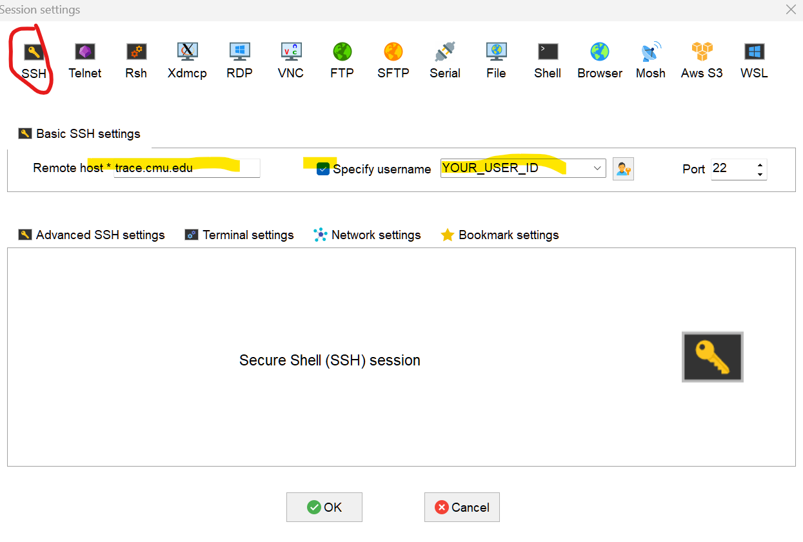
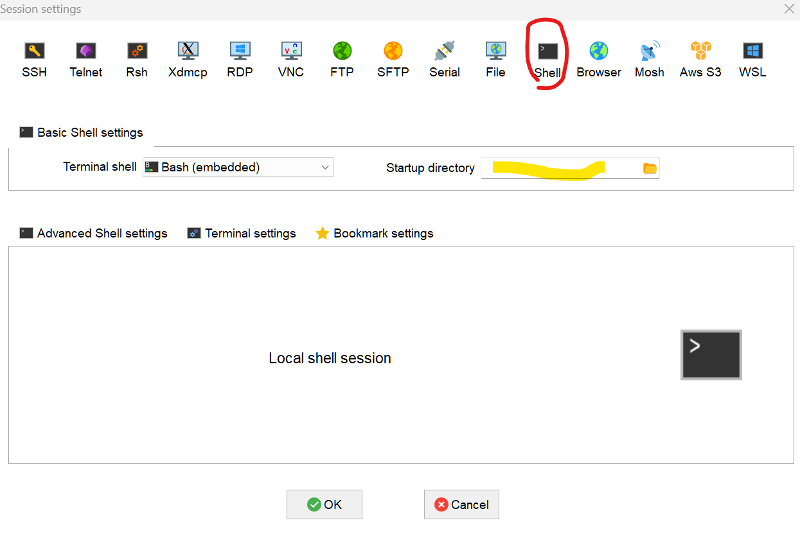

# Code clinic 1: on setting up Jupyter servier on TRACE
#### Bo Ni, May 24, 2024 
### 0. prepraration
#### 1. For windows users, MobaXterm is recommeded for managing different termimals. You can download the free version of it [here](https://mobaxterm.mobatek.net/download.html).
#### 2. To setup MobaXterm, We create and use two kinds of sessions. One for connecting to TRACE and other for local command-line operations (you may also use the later for the first like a real linux user).

For the first one, in MobaXterm window, click the icon "Session". Then, set up a ssh seesion as shown below.

Note that, RED circles means to click it and YELLOW regions mean you need to privide inputs (checking it or typing in information). Similar rules are adopted for the remaining part.

For the second one, again click "Session". Then, set up a bash session as shown below.

At this point, two newly created sessions should be listed on the left column.
Click the first one and type in your passward for TRACE should get you onto trace.
Click the second one and you have a Linux-like terminal at your local computer.

#### 3. On TRACE, upload the job file, "sbatch_JupyterLab_Server.sh", to a location you like. To set the server up, just submit this .sh file like
"""
sbatch sbatch_JupyterLab_Server.sh
"""
Taking a look inside this file, you may find the following is done via it.
> 1. Locate some computing resources, hardware (free to change or adjust) and software (anaconda3/2023.03-1). 
> 2. Start a Jupyter Lab servier and produce a log file with some USEFUL tips for the next step
Once the job is running, check the generated log file on TRACE.
If everything runs, you should find tips about the next step between two lines of pluses. For example, like the following.

"""
+++++++++++++++++++++++++++++++++++++++++++++++++++++++++++++++++++++++++++++++++++++++++++
Do the following on your local terminal: 
ssh -N -f -L localhost:8893:Trace24:8890 bni2@trace.cmu.edu"

ps aux | grep ssh"

Now, in your LOCAL browser, visit the following."
http://127.0.0.1:8893/lab?token=d9ff4bbdfa6b10ef3d07f4a705286c735347b5d37585b150"
+++++++++++++++++++++++++++++++++++++++++++++++++++++++++++++++++++++++++++++++++++++++++++

"""
Note that, depending on which node you get, "Trace24" in the second line will be different in your file.

#### 4. On the local linux-like bash terminal, we connect to the computing note and operate JupterLab via local brower.
To do so, just follow the tips you read in the log file.

That's it. More (on seting up your own virtual enviroments and managing your code via git) to come next time.

